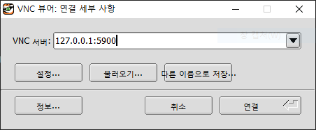
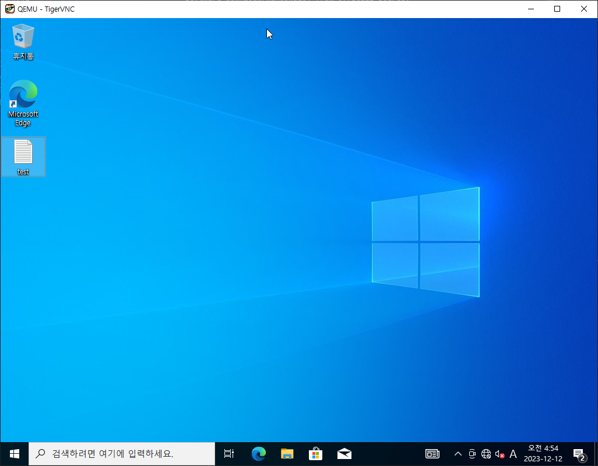

# win10 in docker

Run headless container. Connect via VNC.

This repository is originally forked from [m1k1o/win10-in-docker](
	https://github.com/m1k1o/win10-in-docker) and modified to run on my environment.

## Table of Contents
- [Installation](#Installation)
	- [Before you start](#before-you-start)
	- [Download Windows 10 ISO image](#download-windows-10-iso-image)
	- [Create HDD](#create-hdd)
	- [Build and run container](#build-and-run-container)
- [Connect via VNC](#connect-via-vnc)
	- [On Linux](#on-linux)
	- [On Windows](#on-windows)
	- [Result](#result)
- [How to access files in the virtual machine](#how-to-access-files-in-the-virtual-machine)
	- [Google Drive (recommended) or OneDrive](#google-drive-recommended-or-onedrive)
	- [SCP](#scp)
	- [On Linux (advanced)](#on-linux-advanced)

# Installation

## Before you start

You must have enabled KVM on the host. 

```sh
sudo apt install -y qemu-kvm libvirt-daemon-system libvirt-clients 
sudo apt install -y bridge-utils virt-manager
sudo systemctl enable libvirtd.service
sudo systemctl enable virtlogd.service
sudo modprobe kvm_intel
```

## Download Windows 10 ISO image

Get official [Windows 10 ISO image](https://www.microsoft.com/en-us/software-download/windows10) from official source.

Filename must be `win10.iso`.

## Create HDD

Create HDD image, where system will be installed. Choose custom disk size.

```sh
sudo docker build -t win10-hdd -f hdd.Dockerfile .
sudo docker run --rm -v $PWD:/data win10-hdd 128G
```

## Build and run container

```sh
sudo docker build -t win10 .
sudo run.sh
```

# Connect via VNC
## On Linux

```sh
sudo apt install xtightvncviewer
vncviewer <ip-address>:5900
```

## On Windows
1. Download [VNC Viewer](https://sourceforge.net/projects/tigervnc/files/stable/1.12.0/) and install.
2. Run VNC Viewer and connect to `<ip-address>:5900`.


## Example


# How to access files in the virtual machine

## Google Drive (recommended) or OneDrive
1. Install [Google Drive](https://www.google.com/drive/download/) on the virtual machine.
2. Sync files between the virtual machine and the host.

## SCP
```sh
# Transfer file via scp command
# This command has to be executed in the virtual machine's PowerShell
scp ./<file> <user>@<ip-address>:<path>
```

## On Linux (advanced)
```sh
# Recommended that use after shut down the docker or virtual machine.
kpartx -av win10_hdd.img
mkdir ./mnt
mount /dev/mapper/loop0p2 ./mnt

# To unmount
umount ./mnt
kpartx -dv win10_hdd.img
```
